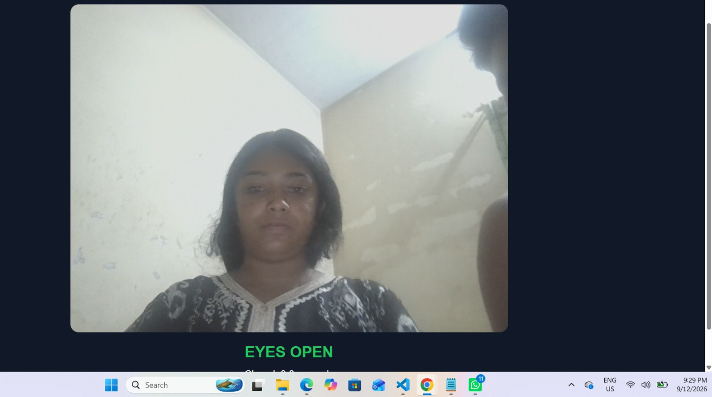
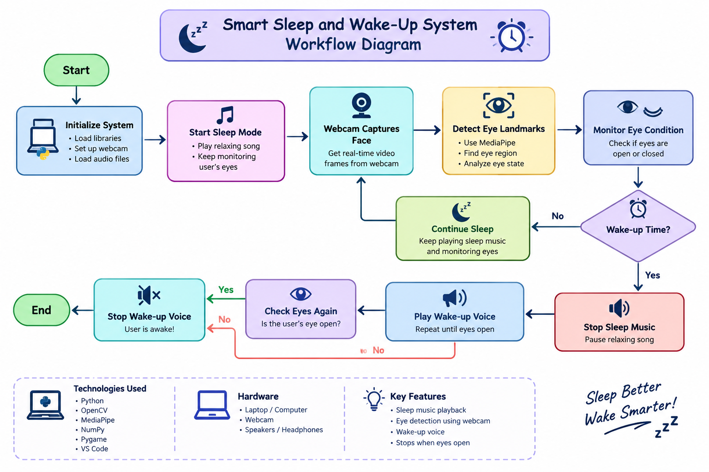

# Smart Sleep and Wake-Up System 😴⏰

## Basic Details

### Team Name: Team Useless

### Team Members
- Team Lead: Amurtha Kaimal - College of Engineering Alappuzha
- Member 2: Anju M B - College of Engineering Alappuzha

### Project Description

The **Smart Sleep and Wake-Up System** is a computer-vision-based smart alarm system designed to make waking up more interactive.

The system plays a relaxing song during sleep mode and uses a webcam to monitor the user's eyes. At the configured wake-up time, a wake-up voice is played repeatedly until the user opens their eyes.

### The Problem (that doesn't exist)

Sometimes people don't wake up even after their alarm rings again and again.

So we decided to solve the extremely serious problem:

**"What if my alarm is shouting at me, but my eyes are still closed?"** 😴😂

### The Solution (that nobody asked for)

We created a smart alarm that doesn't simply make noise and give up.

The system uses a webcam and computer vision to monitor the user's eye condition. When it is time to wake up, the relaxing sleep music stops and the wake-up voice starts playing.

If the user's eyes remain closed, the voice continues repeating. Once the user opens their eyes, the system detects the change and stops the wake-up voice.

Because apparently, the alarm needs proof that you are actually awake. 👀😂

## Technical Details

### Technologies/Components Used

For Software:

- **Language:** Python
- **Computer Vision:** OpenCV
- **Face & Eye Detection:** MediaPipe
- **Numerical Processing:** NumPy
- **Audio Playback:** Pygame
- **Development Tool:** Visual Studio Code

For Hardware:

- Laptop/Computer
- Built-in or USB Webcam
- Speakers/Headphones

### Implementation

For Software:

# Installation

Install the required Python libraries:

```bash
pip install opencv-python
pip install mediapipe
pip install numpy
pip install pygame
```

# Run

Run the project using:

```bash
python main.py
```

## Project Documentation

### For Software

# Screenshots



*Sleep mode is activated and the system plays relaxing sleep music while monitoring the user's eyes.*


*The system detects that the user's eyes are closed and continues the wake-up voice.*


# Diagrams



*Workflow of the Smart Sleep and Wake-Up System, showing sleep mode, webcam-based eye detection, wake-up time detection and eye-based alarm control.*

### Project Workflow

The complete system flow is:

**Webcam → Eye Detection → Eyes Open → Voice 1 Once**

**Webcam → Eye Detection → Eyes Closed → 10 Seconds → Voice 2 Repeats → Eyes Open → Voice 2 Stops → Voice 1 Once**

## Project Demo

# Video

[https://youtu.be/nwj7i8sFZ5I]

*The demo video shows the working of the Smart Sleep and Wake-Up System, including sleep music playback, webcam-based eye detection and the wake-up voice.*

# Additional Demos

- Live webcam eye detection
- Sleep music playback
- Wake-up voice playback
- Closed-eye detection
- Open-eye detection
- Automatic stopping of the wake-up voice

## Team Contributions

- **Amurtha Kaimal:** Team leadership, project coordination and system development.
- **Anju M B:** Python programming, webcam-based eye detection, computer vision and audio integration.

---

Made with ❤️ at TinkerHub Useless Projects


